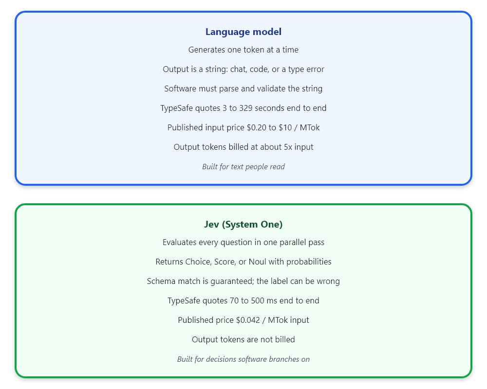
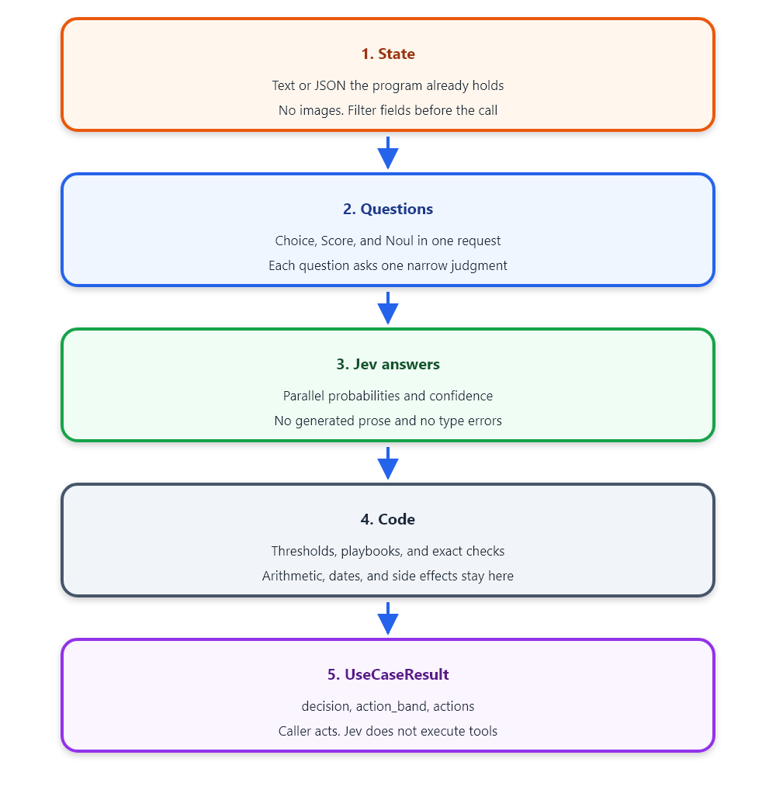
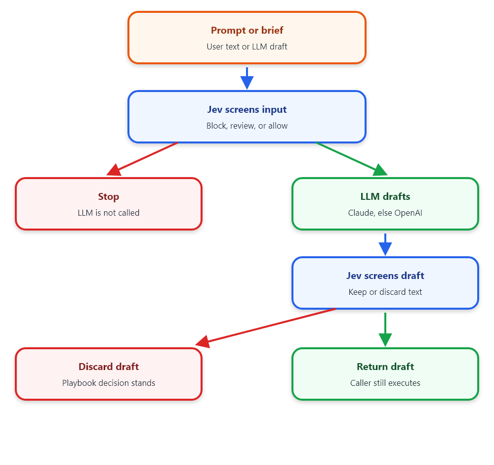

# Jev use cases: typed decisions for software, not chat text

Jev returns Choice, Score, and Noul probabilities in 70 to 500 ms. This repository is the initial implementation of most of the decisions TypeSafe lists for that model.

Jev is the first public System One model from <a href="https://typesafe.ai" target="_blank">TypeSafe AI</a>. Diogo Almeida announced it on 15 September 2026 after TypeSafe left stealth with a seed round led by DCVC. The model does not write prose. A program sends state plus typed questions. Jev returns a value inside the schema the program declared, plus a probability the program can threshold.

## What Jev is

A language model samples the next token from the tokens it already wrote. Software that needs a department, a severity, or a yes-or-no must parse that string and still handle a refusal, a type error, or an invented field. Jev drops string generation. TypeSafe trains it with reinforcement learning for calibrated decisions (RLCD), so the training target is an honest probability on a closed question, not a preferred paragraph.

The public API is one endpoint, `POST https://api.typesafe.ai/v1/systemone`. The body carries `state` (a string, object, or array) and a map of questions. Three question types cover the closed decisions this repository implements:

- **Choice** picks one option from a set you name. The limit is 1 to 255 options. The answer includes the selected key, a probability for every key, and a confidence score.
- **Score** places the state on an ordered rubric of 2 to 10 levels. The answer can fall between levels. It also includes the level probabilities and a confidence score.
- **Noul** answers a yes-or-no instruction with a single probability from 0 to 1. That number is the belief. Noul does not add a separate confidence field.

All three types can sit in one request. TypeSafe states that Jev evaluates them in parallel against the same state, so a tenth question adds tokens and almost no latency. Adding a question does not feed that answer into the next question.

TypeSafe publishes the cost and latency comparison in the launch note. Input is USD 0.042 per million tokens. Output tokens are not billed. End-to-end time on their West Coast service is 70 to 500 ms, against 3 to 329 seconds for the frontier chat models they timed on the same decision shape. Those figures are TypeSafe's, not an independent benchmark. Schema match is guaranteed: Jev cannot return a key you did not declare. It can still return the wrong valid key. Confidence is the signal for that case. Higher confidence tracks higher accuracy in aggregate on their calibration work, and you still set the threshold in code for the cost of being wrong.

The name System One follows Daniel Kahneman's fast judgment in *Thinking, Fast and Slow*. The model name follows William Stanley Jevons. TypeSafe's claim is that a large drop in the cost of a closed decision makes many more of those decisions worth automating. Jev is not a smaller chat model. It has no text decoder for this job. Current model id in our fixture runs was `jev-1.13.0`.

Figure 1 is the split TypeSafe draws between a language model and Jev: string generation versus a typed probability the program can branch on.



*Figure 1: Language model versus Jev*

## How a call is built

Each module in this repository follows the same contract. The program assembles state from records it already trusts. It asks several narrow questions in one call. It reads probabilities. It applies thresholds, playbooks, and exact checks that do not belong in a model: sums, dates, duplicate flags, protected-path matches. The return value is a `UseCaseResult` with `decision`, `action_band`, and `actions`. The caller performs the action. Jev does not send email, move money, or run a shell command.

`action_band` is one of `auto`, `confirm`, `human`, or `block`. A read-only lookup can auto-act at a lower confidence than a refund or a host isolation. A flat probability distribution usually means the criteria are too close, not that the model is "confused" in a way you should ignore.

TypeSafe's own jaggedness note for `jev-1.13` is part of the contract. Jev reads the instruction literally. It does not count reliably, and it does not compare dates as ordered quantities. Accuracy falls when state contains fields the question does not need. User-controlled text in state can steer the answer, so a guardrail that puts attacker text in state has to be tested. Contradictory criteria underperform. Jev does not generate the missing sentence, the code diff, or the audit narrative. When a workflow needs those strings, a generative model writes them and Jev checks the draft.

Figure 2 is that contract as five steps: state, questions, Jev, code, then a result the caller executes.



*Figure 2: Five steps from state to UseCaseResult*

## Why this repository exists

Chat models have been strong at text for years. The missing piece Almeida names in the launch note is automation: a decision a dependency chain can call without parsing a paragraph and without a human in the loop on every branch. TypeSafe's use-case map and workflow evals show the shape. Security alerts, invoices, support threads, and finished agent traces become many small questions plus rules in code. The four published workflows (security incidents, invoice processing, customer service, agent-trace review) score models on agreement with a fixed harness, not on a claim that the harness is the only correct policy.

We built this repository to put most of those decisions into callable Python, with fixtures a developer can run against the live API. It is the initial implementation of that map. It is not a statement that the thresholds, playbooks, or labels are ready for a production queue. Tune confidence cutoffs on labeled traffic before any auto-action moves money, isolates a host, or rejects a person.

On 18 September 2026 the 27 runners that call only Jev each returned a decision from `jev-1.13.0` on the committed fixtures. That run checks wiring and schema. It does not certify accuracy.

The initial set covers the decision shapes TypeSafe documents: classification, detection, scoring, routing, search and ranking, verification, feature extraction, and bounded extraction. The modules are:

- **Routing and triage.** `customer_support`, `model_routing`, `lead_generation`, `gaming`, `agent_harness`.
- **Verification and guardrails.** `llm_guardrails`, `rag_retrieval`, `citation_check`, `agent_trace`, `semantic_linting`, `coding_agent_guardrails`.
- **Records and risk.** `security_incidents`, `invoice_processing`, `insurance_claims`, `financial_crime`, `legal_compliance`, `risk_assessment`.
- **People, catalog, and research.** `recruiting`, `ecommerce`, `moderation`, `advertising`, `demand_forecasting`, `knowledge_graph`, `feature_extraction`, `function_calling`, `hierarchical_classification`, `scientific_discovery`.

Three further runners add a generative model beside Jev for security text. Those are `security_incident_copilot`, `security_guarded_assistant`, and `security_tool_gate`.

## Security paths: Jev gates the language model

A security workflow that needs a sentence still needs a language model. Jev does not write the analyst brief. The initial security runners keep the playbook in code, call Jev first, and call a generative model only when the gate allows it.

Provider selection lives in `jev_usecases.llm`. If `ANTHROPIC_API_KEY` or `CLAUDE_API_KEY` is set, the client calls Claude (`ANTHROPIC_MODEL`, default `claude-sonnet-4-5`). If neither Claude key is set, the client uses `OPENAI_API_KEY` (`OPENAI_MODEL`, default `gpt-4.1-mini`). There is no third provider.

`security_incident_copilot` runs the incident playbook, asks the language model for a brief that must follow that decision, then asks Jev whether the brief matches the decision, stays inside the alert text, and stays defensive. A failed check discards the brief. The playbook decision remains.

`security_guarded_assistant` screens the user text before any generative call. A block returns without calling Claude or OpenAI. An allowed call is screened again on the completion.

`security_tool_gate` asks the language model for one shell command, then runs the same tool gate used by `coding_agent_guardrails`. The runner does not execute the command. `approved` in the metadata is the only signal a caller should trust, and even an allow is still the initial gate, not a change-management approval.

Figure 3 is that gate: a blocked prompt never reaches the language model, and a draft that fails the second screen is discarded.



*Figure 3: Jev screens the prompt and the draft*

## Run the initial set

Python 3.10 or newer. Copy `.env.example` to `.env` and set `TYPESAFE_API_KEY`. Do not commit `.env`.

```bash
python -m venv .venv
.venv\Scripts\pip install -e ".[dev]"
jev-usecases list
jev-usecases run customer_support
```

`jev-usecases run-all` calls every registered runner, including the three security runners that need a reachable Claude or OpenAI endpoint. `jev-usecases security` runs only those three. `pytest -m "not live"` checks thresholds and provider selection without the network. `pytest -m live` calls TypeSafe and needs `TYPESAFE_API_KEY`.

A library call does not go through the CLI. This support example builds state, asks Jev, and returns the decision object:

```python
from jev_usecases.use_cases.customer_support import SupportTicket, evaluate_support

result = evaluate_support(
    SupportTicket(
        message="Charged twice for order A-104. Refund the duplicate.",
        order={"id": "A-104"},
        refund_policy="Duplicate charges are eligible for a refund.",
    )
)
print(result.decision, result.action_band, result.actions)
```

The function sends one System One request, applies the refund playbook in code, and returns `auto`, `confirm`, `human`, or `block`. It does not call a payment API.

## What this initial implementation leaves out

Jev's context is text. Images, audio, and video have to be transcribed or described before they enter state. Open extraction of an unknown string is the wrong primitive. Enumerate candidates in code or with a generative model, then let Jev pick. Counting and date order belong in code. A question that hides several judgments in one sentence should be split. The workflow evals on <a href="https://evals.typesafe.ai/" target="_blank">evals.typesafe.ai</a> measure agreement with GPT-6 Astra and Claude Fable 5.1 at high thinking, not agreement with a human label set. Treat those charts as a cost and latency comparison under one harness.

Thresholds in `jev_usecases.decisions` are starting numbers. They are not fitted to a production false-positive budget.

## Key Takeaways

1. Jev answers closed questions. Choice, Score, and Noul come back with probabilities. The model does not write the string your user reads.
2. Code owns the branch. Thresholds, money, dates, and tool execution stay outside the model.
3. A wrong but valid label is still possible. Gate high-cost actions on confidence, and send the low-confidence tail to a person.
4. This repository is the initial implementation of most published Jev use cases, plus three security runners that put Claude, or OpenAI if no Claude key is set, behind a Jev screen.
5. Fixture success on `jev-1.13.0` shows the calls return typed decisions. It does not show that the playbooks are safe to automate.

Additional reading on harness control for long-horizon agents is <a href="https://www.amazon.com/dp/B0HF3F86YM" target="_blank">Harness Engineering</a>, and on agent graph structure is <a href="https://www.amazon.com/dp/B0HHZVDQQY" target="_blank">Graph Engineering for Agentic AI Systems</a>.

## References

1. **Diogo Almeida (2026).** *Introducing System One Models and Jev.* TypeSafe AI. <a href="https://typesafe.ai/blog/introducing-system-one-models-and-jev" target="_blank">Launch note</a>.
2. **TypeSafe AI (2026).** *Introduction.* TypeSafe docs. <a href="https://docs.typesafe.ai/introduction" target="_blank">Docs</a>.
3. **TypeSafe AI (2026).** *Example use cases.* TypeSafe docs. <a href="https://docs.typesafe.ai/concepts/use-case-map" target="_blank">Use-case map</a>.
4. **TypeSafe AI (2026).** *Jev 1.13 jaggedness.* TypeSafe docs. <a href="https://docs.typesafe.ai/model-jaggedness/jev-1.13" target="_blank">Jaggedness</a>.
5. **TypeSafe AI (2026).** *Workflow evals.* <a href="https://evals.typesafe.ai/" target="_blank">evals.typesafe.ai</a>.
6. **Sydney Runkle and Hunter Lovell (2026).** *Building a Harness with Jev.* LangChain. <a href="https://www.langchain.com/blog/building-a-harness-with-jev" target="_blank">LangChain</a>.
7. **Ken Huang (2026).** *Harness Engineering: Design Patterns for Securing Long-Horizon Multi-Agent AI Systems.* Amazon Kindle. <a href="https://www.amazon.com/dp/B0HF3F86YM" target="_blank">Amazon</a>.
8. **Ken Huang (2026).** *Graph Engineering for Agentic AI Systems.* Amazon Kindle. <a href="https://www.amazon.com/dp/B0HHZVDQQY" target="_blank">Amazon</a>.
